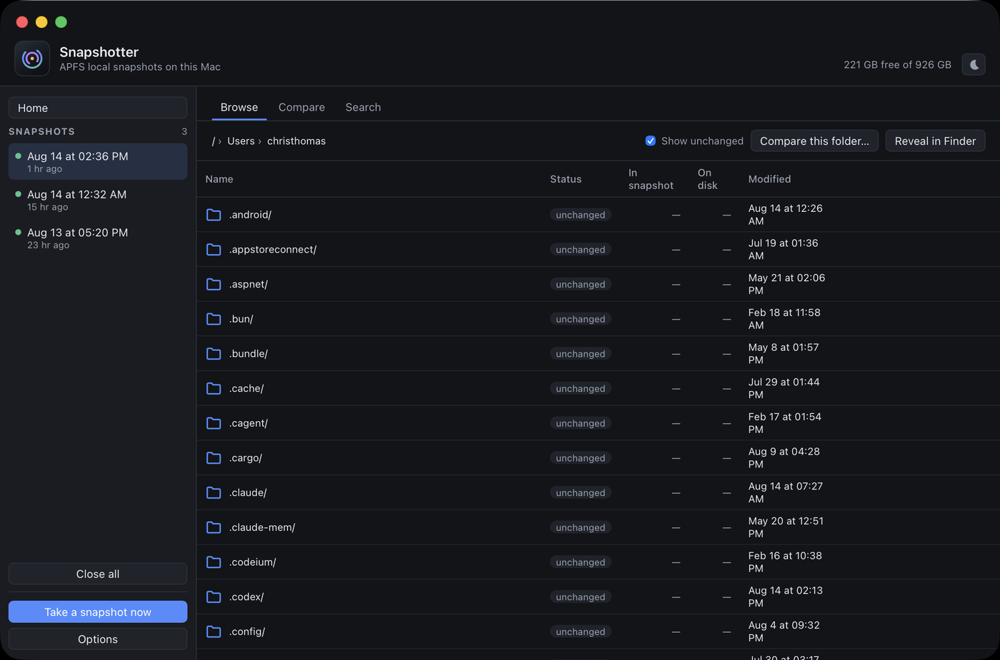
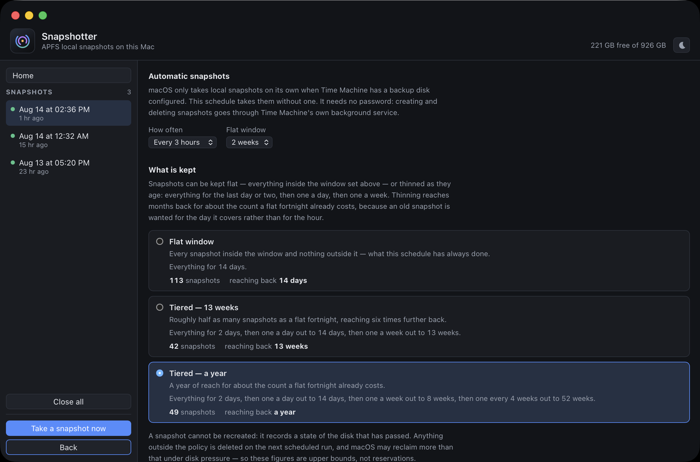

# Snapshotter

A macOS desktop application for APFS local snapshots: browse them, compare them
against the live disk, restore files out of them, and keep them being taken —
without a backup disk.


| Browsing a snapshot, read-only | Scheduling and retention |
| --- | --- |
| [](assets/screenshots/browse.png) | [](assets/screenshots/options.png) |

> **Status: pre-1.0.** Every path has now been run against a real system, mounting
> included. What stands between this and 1.0 is listed in
> [Known limits](#known-limits).

## Install

```sh
brew install --cask antimatter-studios/tap/snapshotter
```

That installs the application and puts `snapshotter` on PATH. The command line
is not a second copy: it is a symlink to the executable inside the bundle, so
`snapshotter version` and the window can never disagree, and — more usefully —
running it uses the application's identity. macOS attributes Full Disk Access to
whichever executable makes the call, so the grant below covers both ways of
running it. A separately installed copy would have needed its own.

The command line alone is enough to take snapshots, list them and check whether
this Mac is protected. Browsing or restoring from one mounts a filesystem, which
is what needs that grant.

Anything the window does not offer is set in `$HOME/.config/snapshotter/config.yaml`.
`snapshotter config` says where that file is and what is in it; `snapshotter config
--write` creates it with the defaults to edit. Single settings can be read and
changed by name, which is the scriptable way in:

```sh
snapshotter config keys                              # everything that can be set
snapshotter config get schedule.interval_hours       # 6
snapshotter config set schedule.interval_hours 3
```

Then grant it Full Disk Access, which mounting a snapshot cannot work without:

> System Settings → Privacy & Security → Full Disk Access → add Snapshotter

Root alone is not sufficient. macOS checks that permission against the
application making the call, so until it is granted every attempt to open a
snapshot is refused with `Operation not permitted`. Opening one also asks for an
administrator password, once per batch.

Releases are signed with Developer ID, notarized and stapled, so nothing has to be
right-clicked past Gatekeeper. How that is produced is in
[docs/RELEASING.md](docs/RELEASING.md).

## Why it exists

macOS takes local snapshots only when Time Machine has a backup destination
configured. Without a backup disk, nothing takes them — and nothing browses them
either, because Time Machine's own interface needs a configured destination and
mounting a snapshot by hand needs root.

That gap has a cost. A tool that cleaned up after itself deleted a directory that
was gitignored, and so was in no repository either. Recovery was impossible:
FileVault plus TRIM rules out undelete, and with no Time Machine destination there
were no local snapshots to fall back on. This application is the missing half —
rollback points against accidental deletion, using no hardware.

It is **not** a backup. Snapshots live on the same disk as the data. They protect
against `rm -rf`, a bad script, a tool that cleans up too eagerly. They protect
against nothing if the SSD fails. Time Machine and snapshots are complementary,
not alternatives.

## What it does

**Health** — one answer to *am I protected right now*: a verdict, the specific
things to act on, and the numbers behind them. Each finding carries its own fix,
so none of them sends you to another tab.

**Browse** — pick a snapshot, walk the folder tree, and see every entry already
marked *unchanged*, *changed*, *deleted since* or *new since*. Reading a folder is
two directory reads, so it stays immediate on any tree.

**Compare** — walk a whole folder recursively and list everything that differs.
Shallow by default (size and timestamp); the *Compare contents* option hashes
files instead, which is slower and certain.

**Search** — find a file by name across every open snapshot. Every other screen
is organised by place, which assumes you know where to look; the moment this
application exists for is the one where you do not. Case-insensitive, shallowest
match first, and it names the snapshots it could *not* search — finding nothing
in the ones that happen to be open must never read as proof that nothing is
there.

**Compare two snapshots** — Compare works snapshot-to-live or snapshot-to-snapshot,
for *what changed between Tuesday and Wednesday*. Which of the two is older is
decided by their own timestamps rather than by the order they were picked in,
because getting that backwards does not fail — it inverts every row, so a file you
recovered reads as one you lost.

**Restore** — copy a file or folder back. By default the copy lands beside the
current file as `<name>.restored-<snapshot-date>`, leaving what is on disk
untouched. *Replace* puts it back at the original path, moving the current file to
a `.bak-` copy first. Nothing is ever deleted.

**Schedule** — install a LaunchAgent that takes a snapshot on an interval and
prunes as they age. Every 6 hours kept a flat 14 days by default, or a tiered
policy: keep everything recent, then thin with age. The same snapshot count
reaches much further — 6h/14d flat is 57 snapshots covering a fortnight, where
tiering reaches thirteen weeks in 34 or a year in 41. The settings screen shows
both numbers for each policy, counted by planning it rather than by arithmetic,
because those two numbers are the whole argument.

**Bulk-deletion tripwire** — watches the directories you name and snapshots as
soon as something starts deleting in bulk in one of them, from its own LaunchAgent
so it keeps watching with the window closed. It cannot *prevent* a deletion —
FSEvents reports what has already happened — but it stops one running to
completion unwitnessed.

Off until you name a directory, and each directory is counted on its own: 200
deletions in `~/projects` trips it, 100 there and 100 in `~/Documents` does not.
It used to watch the whole home directory, which meant most of what it caught was
`~/Library` doing its housekeeping and every catch pinned another whole-volume
snapshot on the disk.

**Menu bar** — the same verdict as the Health tab, visible without the window.

## Running it

```sh
wails3 task package     # builds bin/snapshotter.app
open bin/snapshotter.app

wails3 task dev         # live-reloading development build
go test ./...           # unit tests; no snapshots are touched
```

### Command line

```
snapshotter                   open the window
snapshotter list              the snapshots of the data volume, newest first
snapshotter status            whether this Mac has usable restore points
snapshotter take              take one now
snapshotter run -- <command>  take a snapshot, then run the command
```

`run` is the one thing the window cannot express: it puts the restore point
immediately before the risky thing, rather than up to six hours earlier. If the
snapshot cannot be taken, the command does not run at all, and the command's own
exit status passes through unchanged.

```sh
snapshotter run -- ./migrate.sh
snapshotter run -- git clean -fdx
```

The scheduled task and the tripwire are the same binary, run by launchd as
`--take-snapshot` and `--watch`.

### Integration tests

Guarded, because they change the machine's state:

```sh
SNAPSHOTTER_INTEGRATION=1 go test ./internal/apfs/ -run Integration -v
```

They create a snapshot, list it, delete it, and clean up after themselves. They
never prune by age, because that would destroy restore points belonging to whoever
is running them.

### Driving it by code

The interface cannot be driven by accessibility — presses do not reach into a
WKWebView — so verifying a screen meant launching the app and looking at it. Two
things fix that, and they compose:

```sh
wails3 task server                              # headless: real frontend, real bindings, over HTTP
SNAPSHOTTER_SCENARIO=full-disk wails3 task server
```

Server mode serves the real application with no native window, so a browser or a
`curl` can press things. Scenarios replace this Mac with a described one: a fake
`apfs.Runner` covering tmutil, diskutil and launchctl alike, so any screen can be
put into any state — including states that are impossible or destructive to
produce for real. `empty`, `healthy`, `overdue`, `full-disk`, `time-machine` and
`conflict` are built in; `SNAPSHOTTER_SCENARIO_FILE` takes a JSON one.

A scenario writes its LaunchAgent plists through the real install paths into a
per-process sandbox, never into your real `~/Library/LaunchAgents`, and it says so
in the window, the menu bar and the log — a simulated machine that looked real
would be indistinguishable from one that lies.

See [docs/AUTOMATION.md](docs/AUTOMATION.md).

### Developing without the ability to mount

Mounting needs root *and* Full Disk Access. Nothing in the path translation,
diffing or restore code knows how the tree under a mountpoint arrived there, so a
directory can stand in for one:

```sh
open bin/snapshotter.app --env SNAPSHOTTER_FAKE_MOUNTS=1
```

Every snapshot is "opened" by cloning a seed directory (`SNAPSHOTTER_FAKE_SEED`,
default `$HOME`) and injecting one of each difference the interface renders, so
Browse, Compare and Search have every state to show.

The stand-in is **sealed read-only** after populating, because a real mount is
read-only and code that wrote into a snapshot would otherwise pass here and fail
against a mount. That was the only respect in which a populated directory was
still unlike a mount; closing it is what makes the rest of the work trustworthy
before mounting is verified.

It also announces itself in the interface, refuses to remove any directory lacking
its marker, and refuses *Replace* restores — fake contents overwriting a real file
would destroy real work to demonstrate a feature.

## Permissions

Creating, listing and deleting snapshots need **no privileges**: `tmutil` is a
client of `backupd`, which does the privileged work. The same is true of the
schedule and the tripwire.

Mounting needs **root**, and that is the only prompt this application raises.
`mount(2)` attaches a filesystem to the global namespace, which is privileged
regardless of who owns the files inside — and an unprivileged mount could use
`-o noowners` to read every user's home directory. Snapshots are mounted
read-only, so browsing cannot alter what was recorded.

Mounting is batched: *Open all* attaches every snapshot behind a single password
prompt.

What gets elevated is **this application's own binary**, re-invoked as a helper,
which then calls `mount_apfs`. That is not tidiness: TCC judges the identity of the
elevated process, and `/sbin/mount_apfs` carries Apple's identity rather than ours,
so a Full Disk Access grant on this application could never reach it.

Two consequences worth knowing before they look like faults:

- **Real mounts only work from a packaged, FDA-granted `.app`.** Under `go run`,
  `wails3 task run` or a bare binary the identity is not the bundle's and mounting
  is refused. That is correct, and it is the first thing to check.
- **The grant survives rebuilds, but only because the signature is stable.**
  `task package` looks up a Developer ID in the keychain and signs with it, so the
  requirement TCC records names the bundle identifier and the certificate. An
  ad-hoc signature is keyed to the build's cdhash instead, and every repackage
  produces a new one — a grant that worked yesterday then stops silently, which
  presents as the mount path breaking rather than as a lapsed permission. A machine
  with no Developer ID still builds; it falls back to ad-hoc and says why.

## Layout

| Path | What lives there |
| --- | --- |
| `internal/apfs` | `tmutil` — list, create, delete, prune, Time Machine state |
| `internal/cli` | the command line: `list`, `status`, `take`, `run` |
| `internal/diffs` | recursive `Compare`, one-level `Level` |
| `internal/elevate` | the one authorization prompt |
| `internal/find` | searching inside a snapshot by name |
| `internal/scenario` | a fake machine, for driving the interface |
| `internal/mountmgr` | mounting snapshots, and the fake that stands in for it |
| `internal/notify` | notifications when protection lapses |
| `internal/restore` | copying files back out, non-destructively |
| `internal/schedule` | the two LaunchAgents, and retention policy |
| `internal/vfs` | live ⇄ snapshot path translation, directory reads |
| `internal/watch` | the bulk-deletion tripwire |
| `services/` | the Wails bridge to the frontend |
| `frontend/src` | React interface |

Every package that shells out takes a `Runner`, so the parsing and the safety
guards are tested without invoking `tmutil`.

## Development

Git hooks come from
[github-guard](https://github.com/antimatter-studios/agent-skills): squash-only
merges, a protected default branch, no merge commits, plus `gofmt` and `go vet` on
commit and `go test` on push. A fresh clone needs one command to activate them:

```sh
git config core.hooksPath .githooks
```

The Go guards skip themselves when `frontend/dist` has not been built, because
`frontend/embed.go` embeds it — otherwise a fresh checkout could not commit at all. Build
the frontend once (`wails3 task build`) and they engage.

One project-local guard exists for an irritation rather than a risk:
`wails3 generate bindings` emits trailing whitespace in its doc comments, which
the whitespace guard rightly blocks. `generated-normalise` strips it from
`frontend/bindings/` only and never blocks, so regenerating bindings does not
tempt anyone into `--no-verify` — a flag that would switch off every other guard
at the same time.

## Known limits

- **Mounting needs a permission only the user can give.** It works, and is now
  exercised against real snapshots, but every machine needs Full Disk Access
  granted to the bundle by hand before a snapshot will attach — root is necessary
  and not sufficient. Until that is granted, `mount_apfs` fails with `Operation
  not permitted`, which reads like an ownership problem and is not one.

  This was diagnosed the long way round, so the wrong turns are worth recording:
  granting FDA to the bundle appeared not to help, and the conclusion drawn was
  that TCC blamed `/usr/bin/osascript` and that an `SMAppService` helper was the
  only fix. Both were wrong. What matters is the identity of the binary that is
  *exec'd*, and elevating `/sbin/mount_apfs` runs a binary carrying Apple's
  identity rather than ours, which no grant on this application can reach.
  Elevating our own binary instead fixed it, with no privileged daemon.
- **Ad-hoc signatures do not keep a TCC grant.** TCC keys an ad-hoc signed bundle
  on its cdhash, and every `wails3 task package` produces a new one — so a Full
  Disk Access grant works once and stops silently after the next build, which
  presents as a regression in the mount path rather than as a lapsed grant. A
  stable signing identity is a prerequisite, not a distribution nicety. For the
  same reason a grant aimed at a bundle on removable media is not durable.
- **Snapshots are whole-volume, and every volume at once.** APFS has no per-path
  snapshot and no exclusion mechanism. `tmutil localsnapshot` takes no arguments
  at all — not a volume, not a flag — so it snapshots every eligible mounted APFS
  volume simultaneously, and there is no way to ask for one. Every neighbouring
  verb takes a mount point (`listlocalsnapshots`, `thinlocalsnapshots`,
  `deletelocalsnapshots`); creation is the one Apple did not make selectable.

  So an external APFS disk is snapshotted whenever the startup disk is, whether
  or not anyone wanted that. Snapshotter lists and prunes every volume for this
  reason, and the Health screen reports each one's own free space and pinning
  snapshot — a container is per volume, so neither is knowable from the boot
  volume's numbers. `tmutil addexclusion -v <volume>` is the only lever for
  keeping a disk out of it altogether.
- **No per-snapshot size, ever.** A snapshot shares blocks with the live volume
  and with its neighbours, so the question has no single answer. What is reported
  instead is which snapshots are purgeable and which one pins the container.
- **Mounts are left attached on quit.** Detaching needs root, and a password
  prompt on the way out is a poor trade for tidying something read-only. A mounted
  snapshot cannot be deleted, so leftover mounts block pruning — *Close all* is in
  the sidebar.
- **This source tree is snapshotted, but not reachable from inside the
  application.** It lives on an SD card, which is a different volume — and an
  APFS one, so `tmutil localsnapshot` sweeps it up with everything else. The
  snapshots exist and are pruned along with the rest.

  What they are not is browsable or restorable here: `mountmgr` refuses any
  source but the data volume, deliberately, because "the volume to read from" is
  exactly the argument worth controlling in a process that mounts as root. Recover
  from them with `mount_apfs` by hand.

## Changelog

Most recent releases; the full history lives in [CHANGELOG.md](CHANGELOG.md).

### v0.63.0

`snapshotter list` answers for every disk rather than the startup one alone,
grouped by volume with each disk's name and mount point. Local snapshots are
written to every mounted APFS volume at once, so answering "what is on the SD
card" used to mean leaving this application and reading diskutil — where it is
easy to miss which snapshot is holding a container open, because that is a
different line from the one saying it is purgeable.

### v0.62.2

Every disk that was not the startup disk carried a note above its snapshots saying
that browsing what is inside them was the startup disk's alone. That stopped being
true when snapshots on any volume became browsable, and the note stayed —
contradicting what the application had just done. It is gone.

### v0.62.1

The status bar's two halves say different things: the left says what is happening,
the right says how far it has got. They change independently, because reading a
folder, asking the event log and walking the disk are three stages of one wait and
only the last of them has a number — and the bar appeared for that one alone,
which left the first two looking like nothing happening. Where there is no number
it moves rather than fills, because a bar at an invented percentage would be a
claim about progress nobody is measuring.

### v0.62.0

Browsing a snapshot stopped re-reading whole trees to answer questions it had
already answered. Deciding a folder has changed needs one difference; deciding it
has not needs everything under it read, and on an SD card that was seconds per
folder. A difference is now recorded where it was found — one path, re-checked
with a single stat, which answers that folder and every folder above it — and
kept between runs. The reverse holds too: a walk that finishes without finding
anything has already read every folder below it, and now says so. What macOS
already remembers is harvested first, and `change_detection.ignore` names the
paths not worth reading at all. Clicking a folder blanks the window immediately
rather than eight seconds later, and the trail across the top no longer offers
folders outside the volume being browsed. The status bar along the bottom is now
always there, saying what the window is doing even when there is nothing to count.

### v0.61.0

A status bar along the bottom of the window counts the slow work — "Checking
folders 245/567" — so work that takes a while reads as progress rather than as a
freeze. A bar rather than a spinner, because the count is knowable.

### v0.60.2

The Health screen said "Checking…" and never finished. Working out which volume a
path is on costs twenty-odd subprocesses, and it was being done once per
directory entry — thousands of them for a single folder. Names are now looked up
only for volumes that reach the screen, the answer is cached for a few seconds,
and the lookup happens once per listing rather than once per file.

### v0.60.1

Opening a snapshot is the slowest thing in the window and it said nothing until
it was over. Waiting is a spinner now, the outcome is a tick or a cross held long
enough to read, and an overlay names the password prompt that most of the wait
actually is. Selecting a snapshot on another volume also briefly reported that
the home directory is not on it — the device changed before the folder did, and
the two are one value now.

### v0.60.0

A built-in manual: five pages compiled into the binary, listed by `snapshotter
help` and read with `snapshotter help <topic>`. The documentation was already
written and none of it reached the machine it was about. Also, a volume that
cannot be identified is now an error rather than a silent fall back to the home
folder — which on an external disk opened a path that does not exist inside that
snapshot and read as an empty one.

### v0.59.1

Browsing a snapshot on another volume reported that the volume was "not on the
data volume", because path translation assumed there was only one. It now
translates against the volume being browsed — and coming back out lands on that
volume too, where it used to return a path on the startup disk and aim a restore
at the wrong disk.

### v0.59.0

A snapshot on another volume can be looked inside, not only opened. Browsing,
comparing, searching and restoring all name the volume now, because a snapshot
name does not identify a copy — the same date exists on every volume that was
mounted when it was taken. Browsing starts at a home directory on the startup
disk and at the volume's own root anywhere else.

## Design decisions

[docs/DECISIONS.md](docs/DECISIONS.md) records why things are the way they are,
including the traps that cost real debugging.
[docs/TROUBLESHOOTING.md](docs/TROUBLESHOOTING.md) records the faults that have
actually happened, with the fix for each — start there when something is wrong
rather than reading the decisions. [docs/ROADMAP.md](docs/ROADMAP.md) orders the
outstanding work by what can be verified rather than by what is worth most.
